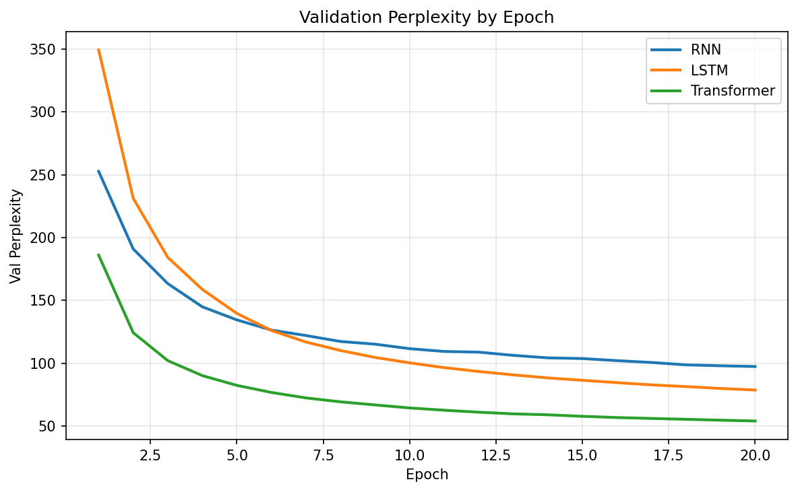
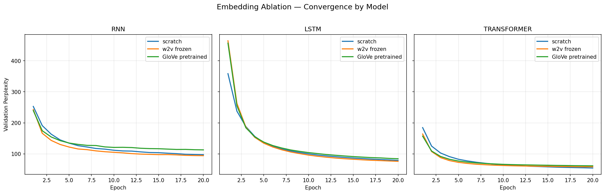
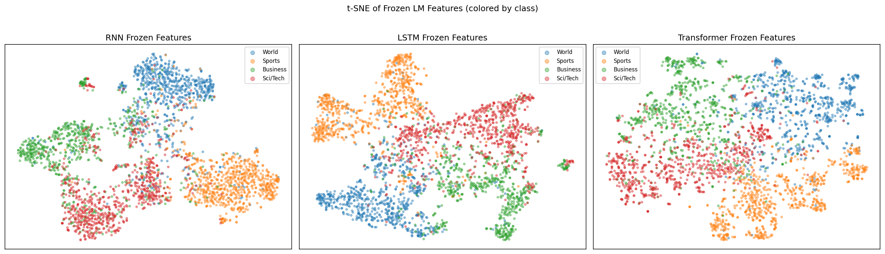

# Language Model Comparison on AG News

Systematic comparison of n-gram, RNN, LSTM, and Transformer language models trained on the [AG News](https://huggingface.co/datasets/ag_news) dataset (~96K news articles, ~4.7M tokens). Includes embedding ablation studies and downstream topic classification.

Built for **NUS ST5230** (Applied NLP) Assignment 1.

## Overview

| | Part I: LM Comparison | Part II: Embedding Ablation | Part III: Downstream Task |
|---|---|---|---|
| **Goal** | Compare LM architectures | Ablate embedding layers | Classify with learned representations |
| **Models** | Bigram, Trigram, RNN, LSTM, Transformer | 3 embeddings x 3 models (9 runs) | Frozen probes + fine-tuning |
| **Metric** | Perplexity, training/inference time | Convergence speed, final PPL | Accuracy, macro F1 |

All neural models share the same vocabulary (20K), embedding dimension (100), depth (2 layers), and training setup for fair comparison (~4.06--4.28M parameters each).

## Key Results

### Part I: Language Model Perplexity

| Model | Test PPL | Train Time | Inference (ms/batch) |
|---|---|---|---|
| Bigram | 849.76 | 5.3s | 4.73 |
| Trigram | 3735.70 | 10.0s | 6.03 |
| RNN | 96.26 | 31 min | 0.90 |
| LSTM | 77.82 | 33 min | 0.94 |
| **Transformer** | **53.59** | 35 min | 2.26 |

<p align="center">
  
</p>

### Part II: Embedding Ablation (Test PPL)

| Model | Scratch | W2V Frozen | GloVe Frozen |
|---|---|---|---|
| RNN | 96.26 | **93.13** | 111.39 |
| LSTM | 78.00 | **75.06** | 83.12 |
| Transformer | **53.83** | 57.65 | 60.76 |

Domain-matched W2V wins for recurrent models; the Transformer prefers learning embeddings from scratch.

<p align="center">
  
</p>

### Part III: Downstream Classification (AG News, 4-class)

| Method | Accuracy | Macro F1 |
|---|---|---|
| BoW + Logistic Regression | 0.902 | 0.902 |
| RNN frozen + Linear | 0.840 | 0.840 |
| RNN frozen + MLP | 0.857 | 0.857 |
| LSTM frozen + Linear | 0.871 | 0.871 |
| LSTM frozen + MLP | 0.883 | 0.883 |
| TF frozen + Linear | 0.880 | 0.879 |
| TF frozen + MLP | 0.906 | 0.906 |
| **Transformer fine-tuned + Linear** | **0.931** | **0.931** |

<p align="center">
  
  <br>
  <em>t-SNE of frozen features colored by class. Transformer features show the clearest cluster separation.</em>
</p>

## Project Structure

```
.
├── configs/
│   └── default.yaml                 # All hyperparameters (single source of truth)
├── src/
│   ├── tokenizer.py                 # Word-level tokenizer + vocabulary
│   ├── data.py                      # AG News loading, splits, DataLoaders
│   ├── ngram.py                     # Bigram & trigram with Laplace smoothing
│   ├── rnn_lm.py                    # Vanilla RNN language model
│   ├── lstm_lm.py                   # LSTM language model
│   ├── transformer_lm.py            # Decoder-only Transformer (GPT-style)
│   ├── embeddings.py                # Embedding variants (scratch, W2V, GloVe)
│   ├── downstream.py                # Classification heads + BoW baseline
│   ├── train.py                     # Shared training loop
│   ├── sanity.py                    # Pre-training sanity checks
│   └── utils.py                     # Perplexity, generation, plotting helpers
├── notebooks/
│   ├── part1_lm_comparison.ipynb    # Train & compare all LMs
│   ├── part2_embedding_ablation.ipynb  # 3x3 embedding ablation grid
│   └── part3_downstream.ipynb       # Downstream classification
├── report/
│   └── report.pdf                   # Final report (6 pages)
├── outputs/
│   ├── models/                      # Saved checkpoints (.pt)
│   └── plots/                       # Generated figures
├── requirements.txt
└── run_all.bat                      # Run all notebooks end-to-end
```

## Design Decisions

- **Shared vocabulary** (20K words) across all models so perplexity is directly comparable
- **Matched dimensions** (embed_dim = hidden_dim = 100, 2 layers) for comparable parameter counts
- **Decoder-only Transformer** using `nn.TransformerEncoder` with causal masking + learned positional embeddings
- **No data leakage** -- Word2Vec trained only on the training split; zero overlap between splits verified
- **Sanity checks** before training: overfit-one-batch, gradient flow, causal mask verification

## Quickstart

```bash
# Install dependencies
pip install -r requirements.txt

# Run notebooks individually
jupyter notebook notebooks/part1_lm_comparison.ipynb

# Or run all three sequentially
run_all.bat
```

**Requirements:** Python 3.10+, PyTorch >= 2.0, CUDA recommended (~35 min/part on GPU).

## Acknowledgements

I declare that Claude was used for LaTeX/markdown formatting and syntax assistance. All model implementations, experiments, and analysis are original work.
