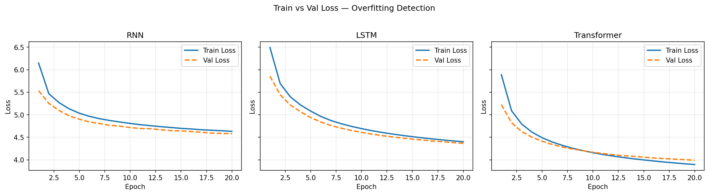
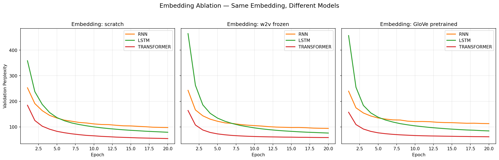
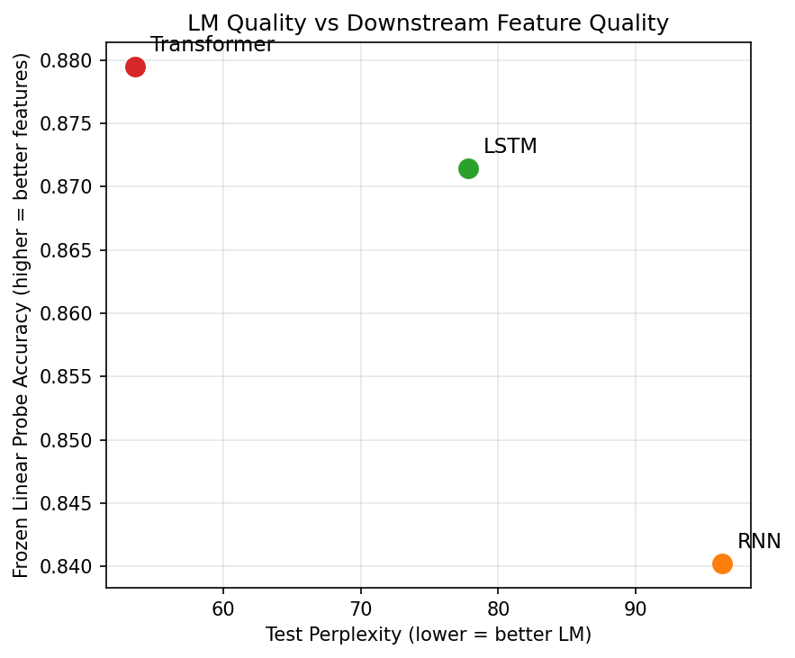
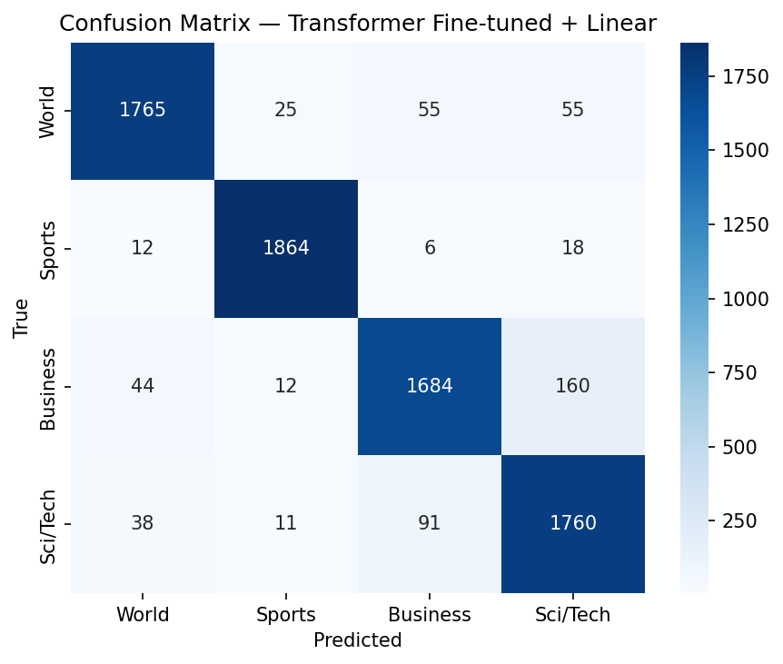
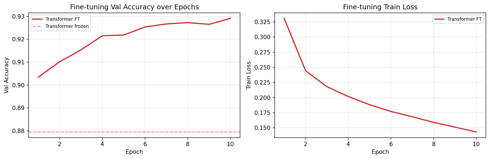

# ST5230 Assignment 1: Language Modeling, Embeddings, and Downstream Classification

## Overview

This report compares four families of language models (n-gram, RNN, LSTM, and Transformer) trained on the same English news corpus under controlled settings. It then investigates how the choice of word embedding affects each neural model, and finally evaluates whether better language models produce better features for a downstream classification task.

All experiments use the **AG News** dataset, a balanced 4-class topic classification corpus (World, Sports, Business, Sci/Tech) with 96,000 training documents (~4.7M tokens) and 7,600 test documents. Tokenization is whitespace-based with lowercasing and punctuation separation, retaining the top 20,000 tokens as vocabulary. Sequences are truncated to 128 tokens. For language modeling, the training data is split 80/10/10 into train/val/test; for downstream classification, the original HuggingFace test split (1,900 per class) is used.

To ensure fair comparison, all three neural language models share the same dimensionality (embed_dim = hidden_dim = 100), depth (2 layers), regularization (dropout = 0.1), and training regime (Adam, lr = 0.001, gradient clipping at 5.0, batch size 64, 20 epochs). This keeps total parameter counts within 4.06M to 4.28M, so performance differences reflect architectural choices rather than model capacity.

---

## Part I: Language Model Training and Comparison

Five language models are trained on the same data: a bigram and trigram (count-based with Laplace smoothing, k = 1), a 2-layer vanilla RNN with tanh activation, a 2-layer LSTM, and a 2-layer decoder-only Transformer (GPT-style, 4 attention heads, d_ff = 400, learned positional embeddings with causal masking).

| Model | Architecture | Parameters |
|---|---|---|
| Bigram | Count-based, Laplace smoothing | N/A |
| Trigram | Count-based, Laplace smoothing | N/A |
| RNN | 2-layer vanilla RNN, tanh | 4,060,400 |
| LSTM | 2-layer LSTM | 4,181,600 |
| Transformer | 2-layer decoder-only, 4 heads, d_ff=400 | 4,275,600 |

### Results

| Model | Val PPL | Test PPL | Train Time | Inference (ms/batch) |
|---|---|---|---|---|
| Bigram | 860.44 | 849.76 | 5.3s | 4.73 |
| Trigram | 3791.59 | 3735.70 | 10.0s | 6.03 |
| RNN | 97.46 | 96.26 | 1878.5s (~94s/epoch) | 0.90 |
| LSTM | 78.75 | 77.82 | 1997.8s (~100s/epoch) | 0.94 |
| Transformer | 54.07 | 53.59 | 2101.9s (~105s/epoch) | 2.26 |

**Table 1.** Perplexity, training time, and inference speed across all language models.

**Figure 1.** Validation perplexity by epoch. The Transformer converges fastest and reaches the lowest perplexity. All three neural models continue improving at epoch 20, with no sign of overfitting (Figure 2).

**Figure 2.** Train vs validation loss for each neural model. The train-val gap remains small throughout, confirming that 20 epochs is appropriate for this dataset size.

### Analysis

The n-gram models serve as a useful baseline, but their perplexity is far higher than the neural models. The trigram (PPL 3736) performs *worse* than the bigram (PPL 850) because Laplace smoothing distributes probability mass uniformly across unseen events, and with 1.0M distinct trigram histories (vs 60K bigram histories), sparsity is far more severe.

Among the neural models, the hierarchy is clear: Transformer (PPL 53.6) > LSTM (PPL 77.8) > RNN (PPL 96.3). The LSTM's 19% improvement over the RNN comes from its gating mechanism, which provides a gradient highway through the cell state and allows better modeling of dependencies across the 128-token window. The Transformer extends this further: self-attention creates direct connections between any two positions, avoiding the sequential bottleneck entirely. Its PPL is 31% lower than the LSTM's.

This quality comes at a cost: the Transformer is the slowest model in both training (105s/epoch vs 100s for LSTM and 94s for RNN) and inference (2.26 ms/batch vs ~0.9 ms), reflecting the O(n^2) attention computation that is not offset by parallelism gains at this small scale.

In generated text, n-gram samples show local coherence but lose topic consistency within a few words. The RNN drifts after ~15 tokens, the LSTM maintains slightly longer coherence, and the Transformer produces the most topically consistent passages (e.g., maintaining "Iraqi president" as a coherent subject throughout a generated sequence).

---

## Part II: Embedding Variants and Ablation

To understand how the embedding layer affects language modeling, the default trainable embeddings are replaced with two frozen alternatives and each neural model is retrained. This gives a 3 x 3 grid of 9 experiments:

- **Scratch**: standard trainable embeddings, randomly initialized (nn.Embedding, 100-dim)
- **W2V frozen**: Word2Vec (Skip-gram, dim=100, window=5) trained on the AG News *training set only* via Gensim, then frozen during LM training. Vocabulary coverage: 99.98% (19,996/20,000 tokens found).
- **GloVe pretrained frozen**: glove-wiki-gigaword-100, a publicly available embedding trained on Wikipedia and Gigaword. Vocabulary coverage: 98.8% (19,768/20,000 tokens found).

Freezing the embedding layer removes ~2M parameters from gradient updates (the 20,000 x 100 embedding matrix), so frozen variants have roughly half the trainable parameters of their scratch counterparts.

### Results

| Model | Trainable Params | Scratch PPL | W2V Frozen PPL | GloVe Frozen PPL |
|---|---|---|---|---|
| RNN | 4.06M / 2.06M | 96.26 | **93.13** | 111.39 |
| LSTM | 4.18M / 2.18M | 78.00 | **75.06** | 83.12 |
| Transformer | 4.28M / 2.28M | **53.83** | 57.65 | 60.76 |

**Table 2.** Test perplexity by embedding variant. Trainable param counts shown as scratch / frozen. Bold indicates the best variant per model.

**Figure 3.** Validation perplexity over 20 epochs for each model-embedding combination. W2V converges to lower perplexity for RNN and LSTM; scratch wins for Transformer.

**Figure 4.** Holding the embedding constant, the Transformer consistently outperforms LSTM and RNN regardless of embedding choice.

### Convergence Speed

Epoch-1 validation perplexity serves as a proxy for how useful the initial embeddings are, compared against the final best perplexity.

| Run | Epoch-1 PPL | Best PPL | Gap |
|---|---|---|---|
| RNN scratch | 252.80 | 97.46 | 155.34 |
| RNN W2V | 242.86 | 94.18 | 148.68 |
| RNN GloVe | 239.55 | 112.84 | 126.71 |
| LSTM scratch | 358.39 | 79.01 | 279.38 |
| LSTM W2V | 464.46 | 75.96 | 388.51 |
| LSTM GloVe | 456.77 | 84.28 | 372.49 |
| TF scratch | 184.57 | 54.42 | 130.16 |
| TF W2V | 164.01 | 58.37 | 105.65 |
| TF GloVe | 157.18 | 61.39 | 95.79 |

**Table 3.** Epoch-1 perplexity as a convergence speed signal.

### Analysis

**W2V dominates for recurrent models.** W2V frozen achieves the best test perplexity for both RNN (93.1 vs 96.3 scratch) and LSTM (75.1 vs 78.0 scratch). W2V was self-trained on AG News, so its embeddings encode domain-specific co-occurrence patterns (e.g., "reuters" near "ap," "shares" near "earnings") with near-perfect vocabulary coverage. GloVe, despite being trained on a much larger corpus (Wikipedia + Gigaword), encodes general-purpose semantics less aligned with news text, performing worst across all three models.

**Scratch wins for Transformer.** Unlike the recurrent models, the Transformer achieves its best perplexity (53.8) with trainable scratch embeddings. Self-attention reshapes representations at every layer based on full-sequence context, so the Transformer can effectively learn task-optimal embeddings during training. The 2M additional trainable parameters in the embedding layer give it more capacity to specialize. Recurrent models, which process tokens through a fixed-size hidden state, benefit more from a good initialization because they have less ability to compensate for poor embeddings.

**LSTM shows a curious convergence anomaly.** For RNN and Transformer, pretrained embeddings provide a warm start (lower epoch-1 PPL). But LSTM scratch (epoch-1 PPL 358) starts *better* than W2V frozen (464) and GloVe frozen (457). This likely reflects the fact that LSTM gate parameters are initialized assuming random-scale inputs; pretrained embeddings with a different scale and distribution cause the gates to behave suboptimally until they adapt over several epochs. Despite the slow start, W2V LSTM still converges to the best final perplexity (75.1), showing that the initial disadvantage is temporary.

---

## Part III: Downstream Task with Learned Representations

Having trained language models of varying quality, the central question is: do better language models produce better features for classification? Frozen representations are extracted from each trained LM and used as features for AG News 4-class topic classification.

### Feature Extraction and Methods

For each LM, a forward pass is run over every document to extract the hidden states at the final layer. These are **mean-pooled** across non-padding positions to produce a single 100-dimensional feature vector per document.

Eight methods spanning four approaches are compared:

| Method | Description |
|---|---|
| BoW + LogReg | Bag-of-words baseline: CountVectorizer + logistic regression (sklearn) |
| Frozen LM + Linear | Frozen LM features fed to a linear classifier (100 -> 4) |
| Frozen LM + MLP | Frozen LM features fed to a 1-hidden-layer MLP (100 -> 128 -> 4, ReLU) |
| Fine-tuned TF + Linear | Transformer backbone fine-tuned end-to-end with differential learning rates (LM: 1e-4, head: 1e-3) |

Frozen probes (Linear and MLP) are applied to all three LM backbones (RNN, LSTM, Transformer); only the Transformer is fine-tuned as the strongest backbone. All classifiers train for 10 epochs with Adam.

### Results

| Method | Accuracy | Macro F1 | F1 World | F1 Sports | F1 Business | F1 Sci/Tech |
|---|---|---|---|---|---|---|
| BoW + LogReg | 0.9022 | 0.9022 | 0.906 | 0.961 | 0.865 | 0.877 |
| RNN frozen + Linear | 0.8403 | 0.8399 | 0.845 | 0.920 | 0.794 | 0.801 |
| RNN frozen + MLP | 0.8572 | 0.8567 | 0.867 | 0.930 | 0.812 | 0.818 |
| LSTM frozen + Linear | 0.8714 | 0.8711 | 0.873 | 0.945 | 0.824 | 0.844 |
| LSTM frozen + MLP | 0.8829 | 0.8829 | 0.882 | 0.948 | 0.842 | 0.859 |
| TF frozen + Linear | 0.8795 | 0.8793 | 0.886 | 0.947 | 0.839 | 0.846 |
| TF frozen + MLP | 0.9059 | 0.9060 | 0.915 | 0.963 | 0.869 | 0.876 |
| **TF fine-tuned + Linear** | **0.9307** | **0.9307** | **0.939** | **0.978** | **0.901** | **0.904** |

**Table 4.** Downstream classification results across all methods. Per-class columns show F1 scores.

**Figure 5.** t-SNE projections of frozen LM features (3,000 test samples, colored by class). Transformer features show the clearest cluster separation; RNN features are the most diffuse.

**Figure 6.** Test perplexity (Part I) vs frozen linear probe accuracy. Better LMs produce better features, but with diminishing returns.

**Figure 7.** Confusion matrix for the fine-tuned Transformer. Sports is cleanest; Business has the most confusion with World and Sci/Tech.

**Figure 8.** Fine-tuning dynamics over 10 epochs. Validation accuracy rises steadily from 90.1% to 92.8% with no sign of overfitting.

### Analysis

**BoW outperforms all frozen linear probes.** A simple bag-of-words baseline (90.2%) beats every frozen LM with a linear head, including the Transformer (88.0%). Topic classification depends heavily on *which words appear* (e.g., "game" and "score" for Sports, "shares" and "profit" for Business), and BoW captures this lexical signal directly. Frozen LM features, shaped by next-token prediction, do not explicitly encode class-discriminative information.

**Nonlinear heads unlock the Transformer's potential.** Adding a one-hidden-layer MLP improves all backbones, but the gain is strikingly uneven: RNN +1.7%, LSTM +1.2%, Transformer +2.6%. The Transformer's larger improvement suggests its frozen features encode richer, more complex structure from self-attention, structure that a linear probe cannot decode but an MLP can. Notably, Transformer frozen + MLP (90.6%) is the only frozen configuration that surpasses the BoW baseline.

**Better LMs produce better features, but with diminishing returns.** The PPL-vs-accuracy plot (Figure 6) shows a clear trend: RNN (PPL 96.3, Acc 84.0%) to LSTM (PPL 77.8, Acc 87.1%) to Transformer (PPL 53.6, Acc 88.0%). However, the relationship is sublinear: the 31% PPL drop from LSTM to Transformer yields only +0.9% accuracy with a linear head. This suggests that beyond a certain LM quality, further perplexity gains capture finer-grained linguistic patterns (syntax, long-range coherence) that do not directly help coarse-grained topic classification.

**Fine-tuning provides the largest single improvement.** The fine-tuned Transformer reaches 93.1%, gaining +5.1% over its own frozen + linear baseline and +2.5% over frozen + MLP. Fine-tuning reshapes the entire representation space: instead of predicting the next token, the model learns to encode topic-discriminative information. Validation accuracy climbs steadily from 90.3% (epoch 1) to 92.9% (epoch 10) while train loss drops from 0.33 to 0.14, with no overfitting.

**Per-class patterns are consistent.** Sports is the easiest class throughout (F1 0.92-0.98), reflecting its highly distinctive vocabulary. Business is consistently the hardest (F1 0.79-0.90), sharing vocabulary with both World (trade, economy, policy) and Sci/Tech (companies, products, markets). Fine-tuning helps the weakest classes most: Business F1 improves from 0.84 (frozen + linear) to 0.90 (fine-tuned), a +6% absolute gain.

**Connection to LM architecture.** More expressive architectures produce richer internal representations, but that richness is only fully accessible through nonlinear probes or fine-tuning. Recurrent models compress information through a fixed-size hidden state, yielding features that are more immediately linearly separable (small MLP gain). The Transformer distributes information across a higher-dimensional attention-derived space that requires more downstream capacity to exploit, but ultimately achieves the best results when given that capacity.

---

## Experimental Controls

- **Parameter fairness:** All neural LMs have 4.06-4.28M total parameters. The shared embedding (20K x 100 = 2M) and output projection (100 x 20K = 2M) dominate; differences come only from the model cores (RNN ~60K, LSTM ~240K, Transformer ~133K + 13K positional).
- **Same pipeline:** All models use the same tokenizer, vocabulary, train/val/test splits, and max sequence length (128).
- **No data leakage:** Word2Vec was trained only on the training split. Zero overlap between splits was verified programmatically.
- **Sanity checks:** Before full training, it was verified that (1) all models can overfit a single batch (loss drops >50%), (2) all parameters receive non-zero gradients, and (3) the Transformer's causal mask prevents future information leakage.
- **Hardware:** All experiments run on a single NVIDIA GeForce RTX 4060 GPU.
- **Reproducibility:** All experiments use seed 42. Hyperparameters are centralized in `configs/default.yaml`.

---

## Limitations

- **Tokenization:** Only whitespace splitting with lowercasing is used, with no subword tokenization (BPE/WordPiece). This inflates the vocabulary with rare surface forms and limits generalization across morphological variants.
- **Training not converged:** All neural models are still improving at epoch 20 with no plateau reached. Longer training or a learning rate schedule would likely improve all models, though relative rankings are unlikely to change.
- **Single dataset:** All results are specific to AG News (short news snippets, 4-class topic classification). Findings about embedding choices and downstream transfer may not generalize to longer documents, more fine-grained tasks, or other domains.
- **Small scale:** Models are 2-layer, 100-dim (~4M parameters). At larger scales, the Transformer's advantage over recurrent models would likely widen due to better parallelism and deeper attention stacking.
- **Frozen-only embeddings in Part II:** The ablation compares frozen pretrained vs. trainable scratch, but does not test *fine-tuned* pretrained embeddings (initialize from W2V/GloVe then allow gradient updates), which could combine the benefits of both approaches.
